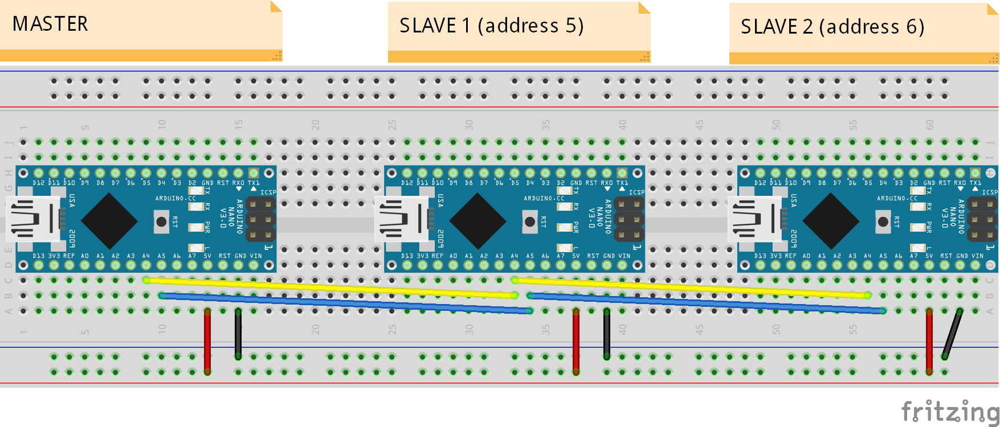

# Extension
Library for extending the capabilities of an Arduino with other identical ones. 
Extension uses the Wire library under the hood to send messages to the different devices.

# How To Use #

## 1- Wire your setup
Devices must be wired to create an I2C bus. Here is an example using 2 slaves:



You should now be able to power the whole chain through the master.


## 2- Program your slaves
Each slave device must be programmed using a unique id (i.e. I2C address). Here is what your slave code should look like:

````
#include "Extension.h"

void setup(){
  Extension::slave(5) ; // use a different address for each slave
}

void loop(){  
}
````


## 3- Program your master
You can now program the master and extend it's capabilities through the slaves:
````
#include "Extension.h"

Extension sl1(5) ;
Extension sl2(6) ;

void setup(){
  Serial.begin(9600) ;
  sl1.pinMode(2, INPUT) ;
  sl2.pinMode(2, INPUT) ;
}

void loop(){
  byte v = sl1.digitalRead(2) ;
  Serial.print("Pin 2 of slave 1 is: ") ;
  Serial.println(v) ;
  v = sl2.digitalRead(2) ;
  Serial.print("Pin 2 of slave 2 is: ") ;
  Serial.println(v) ;
  
  // ...
}
````


## 4- How to install
* Download the latest release: https://github.com/patrickleboutillier/arduino-extension/releases
* Follow the Arduino IDE installation instructions: https://www.arduino.cc/en/guide/libraries


# Reference #
Extension supports the following methods that aim to behave exactly like their native Arduino counterparts:
- pinMode(PIN, MODE)
- VALUE = digitalRead(PIN)
- digitalWrite(PIN, VALUE)
- VALUE = analogRead(PIN)
- analogWrite(PIN, VALUE)
